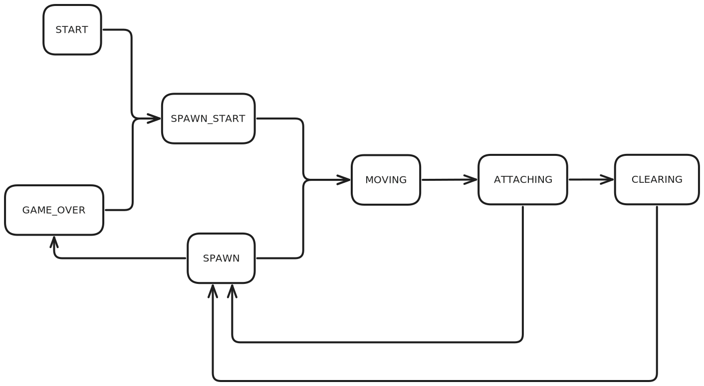

# Brick Game

Implementation of the game Tetris in the C programming language with a terminal user interface.

> "'Tetris' is an inventory management survival horror game from the Soviet Union in 1984."
>
> --- suckerpinch

## Project structure

The project consists of a library that implements the logic of the game.
And a separate CLI application implementing the game's graphics and controls using the `ncurses` library.

### Library

The public interface of the library is described in [brick_game.h](#brick_game/brick_game.h).

Internally it is implemented using a Finite State Machine.
Each update, the function responsible for the current state is dispatched.
Certain conditions cause the current state to transition,
such as the piece touching the ground or clearing a line.

The diagram of all the states and possible transitions can be found below.

{html: width=750px}

The states are more thoroughly described in @ref GameState

### CLI

The CLI displays the game and captures inputs in a terminal using the `ncurses` library.

It is implemented using an MVC design.
With @ref CliController as the controller that runs the main loop,
collects inputs, and updates the model.
@ref GameInfo_t is the model, describing the current state of the game
that needs to be rendered, and @ref CliView is the view that actually renders it.
